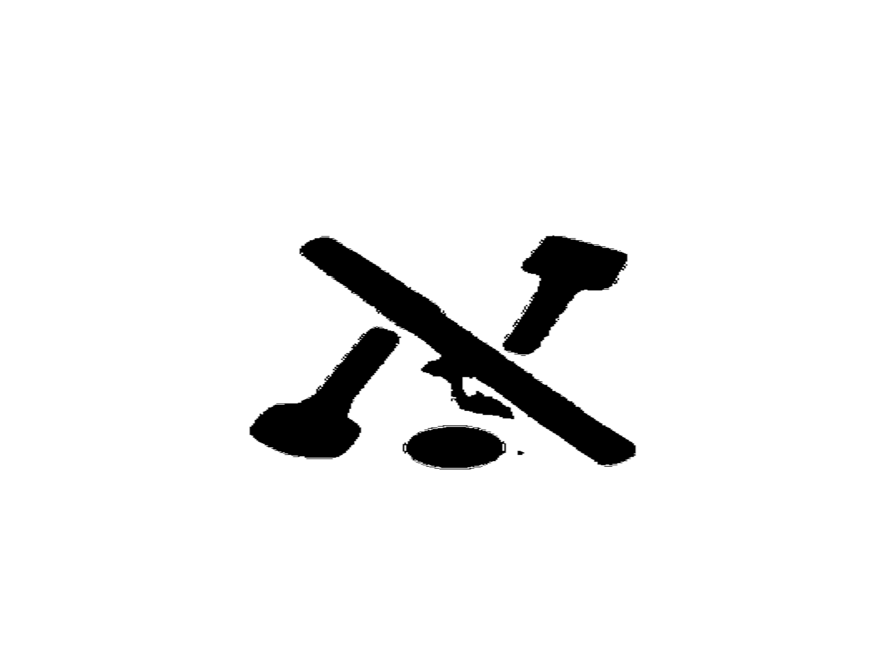
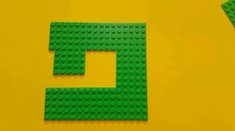
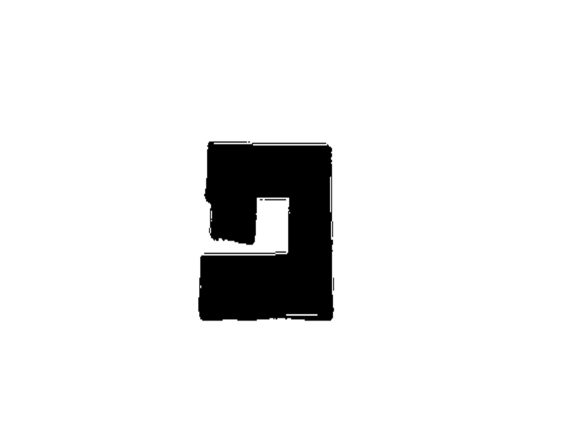

# HebrewCharacterRecognizer

This project is designed to recognize Hebrew characters from object images. It includes functionalities for processing images to remove backgrounds, manipulating the images, adding white backgrounds, and predicting the Hebrew character in the image using a YOLO model.



- Log: Alef



- Log: Feh

## Table of Contents

- [Installation](#installation)
- [Usage](#usage)
  - Running the Server
  - Processing an Image

## Installation

Follow these steps to get the project up and running on your local machine:

1. **Clone the Repository:**

```bash
   git clone https://github.com/<username>/HebrewCharacterRecognizer.git
   cd HebrewCharacterRecognizer
```

2. **Set Up Virtual Environment:**

Create a virtual environment to manage dependencies
  ```bash
    python -m venv .venv
    .venv\Scripts\activate # This is on windows.
  ```

3. **Install Dependencies:**

Install the required packages using pip.
 ```bash
    pip install -r requirements.txt
```

## Usage

- **Running the Server**

To start the Flask server, run:
 ```bash
    python main.py run_server
```
    
    This will start the server at `http://127.0.0.1:5000/`.
    You can use the `/process_image` endpoint to process images via POST requests.

- **Processing an Image**

To process an image without running the server, you can use the process_image command:
```bash
    python main.py process_image --image_path path/to/your/image.jpeg
```
